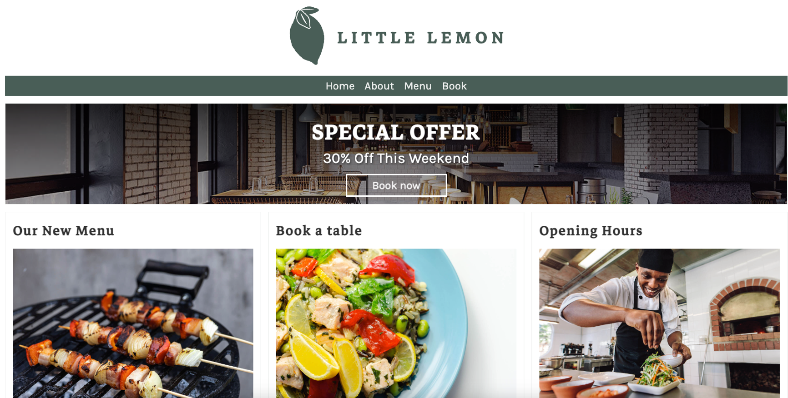
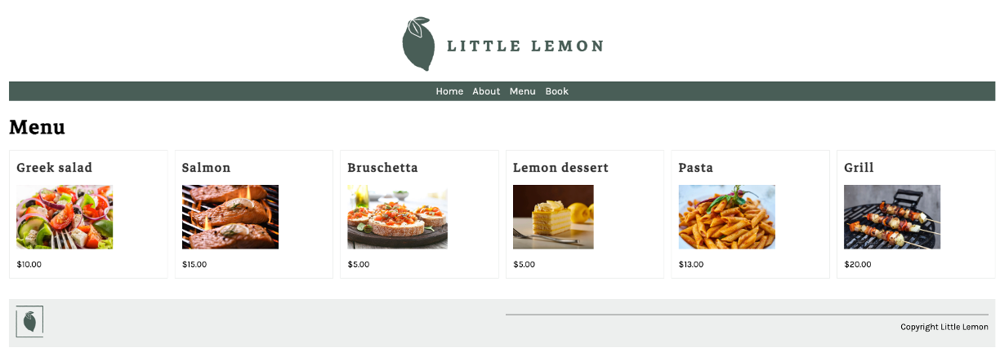
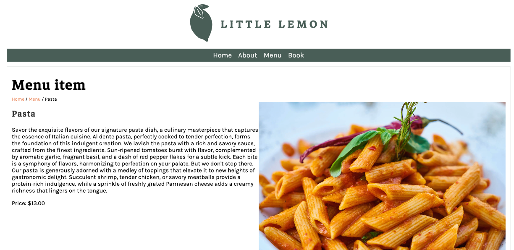
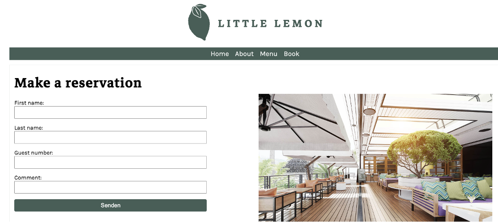
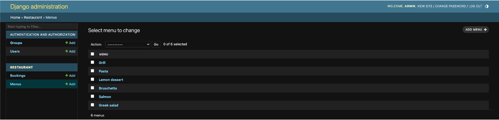

# Meta's Capstone Project: Little Lemon App

## Overview of the Project
The Little Lemon App marks the culmination of the Meta Back-End Developer Capstone course available on Coursera. This project is an immersive exploration into the intricacies of back-end development, leading to the creation of a comprehensive application designed to demonstrate advanced web development techniques.

Built with Python and Django, and leveraging Plain HTML for the front-end along with SQLite for data management, this project showcases the robustness and versatility of using these technologies in tandem to develop dynamic and responsive web applications. The primary goal of this app is to exhibit the capabilities of back-end technologies, with a specific emphasis on a booking system. This system, operational on the back-end, is meticulously crafted to highlight the functionality of server-side operations, underlining the project's educational objective: to showcase back-end development skills, particularly in crafting Django models, views, and templates.

The core feature of this application, the "Book Your Experience" functionality, is a real-world implementation within the broader design framework, refined to ensure smooth user interactions and data management. This feature utilizes Django's powerful ORM for database operations, demonstrating how back-end technologies facilitate the management of complex data and user sessions.

## Technical Highlights
- **Python & Django**: Utilized for the server-side logic, offering a comprehensive framework for web development that simplifies complex coding tasks, enabling the creation of robust web applications.
- **Plain HTML**: Serves as the foundation for the front-end, ensuring that the application remains accessible and functional across various devices and browsers.
- **SQLite**: Employs this lightweight database engine for efficient data storage and retrieval, showcasing its suitability for applications requiring a compact, reliable database solution.

## Visual Highlights: Screenshots
The screenshots below emphasize the Little Lemon App's booking feature, showcasing the Django back-end's capability to handle data processing and user interactions efficiently. 



It demonstrates the seamless integration between Django and the front-end, highlighting how back-end technologies support complex functionalities like user session management and database operations.




This capstone project not only highlights the practical application of key back-end technologies but also demonstrates the power of Python, Django, Plain HTML, and SQLite in creating an engaging, functional, and comprehensive web application. 




The focus on the "Book Your Experience" functionality exemplifies the potential of back-end development to support real-life applications, illustrating the skills acquired through Meta's Back-End Developer track on Coursera.




## Technical Instructions
# Setting Up Your Django Project



Follow these steps to set up your Django project. This guide assumes you are starting with a Django project that already has a `Pipfile` indicating its dependencies.

## Prerequisites
- Ensure you have Python installed on your system. Django requires Python, so having it installed is crucial.
- Check your Python version and ensure Pipenv is installed by following these commands:

    ```bash
    python --version
    pip install pipenv
    ```

## Step 1: Initialize Your Project Environment
Navigate to your project directory and set up your environment:

1. **Install Dependencies with Pipenv**
   - This step installs all dependencies defined in your `Pipfile` and creates a virtual environment for your project.

    ```bash
    pipenv install
    ```

2. **Activate the Virtual Environment**
   - Activating the virtual environment will ensure all Python and pip commands run in this isolated environment.

    ```bash
    pipenv shell
    ```

## Step 2: Set Up the Database
Before running your server, you need to set up your database schemas:

    ```bash
    python manage.py migrate
    ```

This command applies all migrations for Django's built-in apps and any of your project's apps.

## Step 3: Create a Superuser
To access the Django admin interface, you need to create a superuser account:

    ```bash
    python manage.py createsuperuser
    ```

Follow the prompts to set the username, email, and password for the superuser account.

## Step 4: Run the Development Server
Now, you're ready to start the development server and access your project:

    ```bash
    python manage.py runserver
    ```

Your project will be accessible at [http://127.0.0.1:8000/](http://127.0.0.1:8000/) by default.
